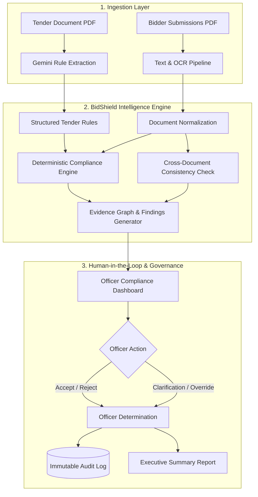

# 🛡️ BidShield AI

> **AI-Powered Integrated Bid Compliance & Verification Platform for GeM Procurement**  
> *Smart India Hackathon (SIH) — Problem Statement PS 26100*  
> *Ministry of Commerce and Industry | Government e-Marketplace (GeM)*

[](https://nextjs.org/)
[](https://www.typescriptlang.org/)
[](https://fastapi.tiangolo.com/)
[](https://www.python.org/)
[](https://supabase.com/)
[](https://ai.google.dev/)
[](https://clerk.com/)
[](https://guidelines.gov.in/)

---

## 📌 Executive Summary

Public procurement on the **Government e-Marketplace (GeM)** involves high-stakes evaluations where each tender attracts dozens of bidders submitting hundreds of pages of statutory credentials (GST, PAN, MSME Udyam, audited financial statements, past experience work orders, and EMD guarantees).

**The Challenge:**
1. **Manual Checklist Fatigue**: Officers spend days reading dense PDFs, cross-checking numbers and registration dates manually.
2. **Siloed Document Checking**: Traditional OCR tools check each document in isolation. They miss **cross-document identity fraud** where a bidder submits a valid PAN card under one legal name and a GST certificate under a slightly different entity name.
3. **Black-Box AI Fallacy**: Generic AI scoring systems ("82% compliant") lack transparency and cannot stand in court, central vigilance reviews, or RTI inquiries.

**The Solution — BidShield AI:**
BidShield AI provides an end-to-end, deterministic, evidence-backed verification pipeline. It automatically extracts structured rules from tender clauses, runs **cross-document entity consistency checks**, cites source documents down to page numbers and field values, and empowers designated procurement officers with a tamper-evident audit trail.

---

## 💡 Core Innovations & Novelty

| Dimension | Conventional Procurement | BidShield AI (Novelty) |
| :--- | :--- | :--- |
| **Document Processing** | Manual check per PDF in isolation | **Automated Cross-Document Consistency Intelligence** across all submitted papers |
| **Entity Verification** | Assumed identical if stamps look valid | **Algorithmic Normalization & Fuzzy Matching** to detect shell/front entity mismatches |
| **Tender Criteria** | Human reading of tender clauses | **Automated Rule Extraction** turning clauses into structured, executable queries |
| **Explainability** | Subjective officer notes or arbitrary AI score | **Zero Black-Box Evidence Chain**: links requirement $\rightarrow$ rule $\rightarrow$ document $\rightarrow$ page $\rightarrow$ finding |
| **Low-Quality Scans** | Ignored or misread by basic OCR | **Confidence-Aware Processing**: OCR $< 70\%$ flags `pending` to prevent AI hallucinations |
| **Auditability** | Dispersed physical paper trails | **Immutable Database Audit Ledger** (`audit_log`) for vigilance and CAG oversight |

---

## 🏛️ System Architecture



---

## 🚀 Key Modules & Capabilities

### 1. Tender-to-Rule Intelligence
- Converts natural language tender eligibility sections into structured rule schemas:
  - Financial turnover thresholds (e.g., *₹10 Crore average over FY22–FY25*)
  - Statutory registrations (*Active GSTIN, PAN Card, MSME Udyam*)
  - Prior experience requirements (*3 completed orders $\ge$ ₹2 Crore in last 5 years*)
  - Earnest Money Deposit (EMD) bank guarantee criteria

### 2. Cross-Document Consistency Engine
- Implements specialized legal entity name normalization (`app/services/matching.py`):
  - Normalizes corporate suffixes (`Pvt Ltd`, `Private Limited`, `LLP`, `Inc`, `Co.`)
  - Cleans whitespace, punctuation, and typographical differences
  - Executes fuzzy token-matching across documents to alert officers when a bidder attempts to swap legal entities between filings

### 3. Evidence-First Review & Comparison Grid
- Every compliance observation (Finding) carries structured evidence:
  - Document ID & filename
  - Exact extracted field and value
  - Page number reference
  - Plain-language explanation templates (no unpredictable LLM text generation during evaluation)

### 4. Enterprise Role-Based Access Control (RBAC)
Integrated via **Clerk Authentication** with a synchronized Supabase database:
- 🛡️ **Administrator**: Manages platform users, assigns roles (`procurement_officer`, `auditor`, `administrator`), and configures system parameters.
- 📋 **Procurement Officer**: Creates tenders, approves extracted rules, uploads bidder documentation, executes verification pipelines, and takes official review decisions.
- 👁️ **Auditor**: Dedicated read-only access to live tenders, compliance statistics, evidence comparison grids, and tamper-evident audit trails.

### 5. GIGW 3.0 & WCAG 2.1 AA Design System
- Built to official Government of India web standards:
  - National tricolor visual identity and emblem integration
  - Variable font sizing controls (`A-`, `A`, `A+`)
  - Instant High Contrast accessibility toggle
  - Multilingual header support (English / हिन्दी)
  - Edge-to-edge modern responsive layout

---

## 🛠️ Technology Stack

```
BidShield-AI/
├── frontend/                  # Next.js 16 Web Application (App Router, Turbopack)
│   ├── app/
│   │   ├── components/        # Header, Footer, Sidebar, Modals, Status Badges
│   │   ├── manage-users/      # Administrator User Management Portal
│   │   ├── tenders/           # Tender Listings, Creation, Dashboard, Audit Grid
│   │   ├── sign-in/           # Clerk Enterprise Sign-In
│   │   ├── sign-up/           # Clerk Officer Registration
│   │   └── globals.css        # Government Portal Design Tokens & Base Styles
│   └── middleware.ts          # Clerk Route Authentication Protection
│
├── backend/                   # FastAPI High-Performance Python Microservice
│   ├── app/
│   │   ├── routes/            # Tenders, Bidders, Documents, Findings, Audit, Users
│   │   ├── services/
│   │   │   ├── compliance_engine.py  # Deterministic Rule Evaluation Logic
│   │   │   ├── gemini_extraction.py  # Google Gemini 1.5 Pro AI Parsing
│   │   │   ├── matching.py           # Legal Name Normalization & Cross-Doc Check
│   │   │   └── pdf_extraction.py     # PDF Parsing & Extraction Engine
│   │   └── supabase_client.py        # Supabase Service Role Integration
│   └── requirements.txt
│
└── supabase/                  # PostgreSQL Database Migrations & Seeds
    ├── migrations/
    │   ├── 001_initial_schema.sql         # Tenders, Rules, Bidders, Documents, Findings, Audit
    │   └── 002_add_users_and_clerk_auth.sql # Users Table & Clerk RBAC Integration
    └── seed.py                # Synthetic Bidder Evaluation Demo Dataset
```

---

## ⚡ Quickstart Setup Guide

### Prerequisites
- **Node.js**: v18.0.0 or higher
- **Python**: v3.10 to v3.13
- **Supabase Account**: Free or Pro tier ([supabase.com](https://supabase.com))
- **Google Gemini API Key**: ([ai.google.dev](https://ai.google.dev/))
- **Clerk Account**: For authentication & user roles ([clerk.com](https://clerk.com))

---

### Step 1: Clone the Repository
```bash
git clone https://github.com/Rithishwaran-eng/BidShield-AI.git
cd BidShield-AI
```

---

### Step 2: Supabase Database Setup
1. Create a new project in your Supabase dashboard.
2. In the **SQL Editor**, execute the migration scripts in order:
   - Run `supabase/migrations/001_initial_schema.sql`
   - Run `supabase/migrations/002_add_users_and_clerk_auth.sql`
3. In **Storage**, create a new private bucket named:
   - Bucket Name: `bid-documents` (Public: **OFF**)
4. Retrieve your credentials from **Project Settings > API**:
   - Project URL (`SUPABASE_URL`)
   - `anon` public key (`SUPABASE_ANON_KEY`)
   - `service_role` secret key (`SUPABASE_SERVICE_ROLE_KEY`)

---

### Step 3: Backend Configuration & Launch
```bash
cd backend

# Create virtual environment
python -m venv venv
# Windows:
venv\Scripts\activate
# Linux / macOS:
source venv/bin/activate

# Install dependencies
pip install -r requirements.txt

# Create .env file
cp .env.example .env
```

Edit `backend/.env`:
```env
SUPABASE_URL=https://your-project-id.supabase.co
SUPABASE_SERVICE_ROLE_KEY=your-supabase-service-role-key
GEMINI_API_KEY=your-gemini-api-key
FRONTEND_URL=http://localhost:3000
```

Start the backend server:
```bash
uvicorn app.main:app --reload --port 8000
```
*API docs available at: `http://localhost:8000/docs`*

---

### Step 4: Frontend Configuration & Launch
```bash
cd ../frontend

# Install dependencies
npm install

# Create local environment file
cp .env.example .env.local
```

Edit `frontend/.env.local`:
```env
NEXT_PUBLIC_API_URL=http://localhost:8000
NEXT_PUBLIC_SUPABASE_URL=https://your-project-id.supabase.co
NEXT_PUBLIC_SUPABASE_ANON_KEY=your-supabase-anon-key

# Clerk Authentication Keys (From clerk.com dashboard)
NEXT_PUBLIC_CLERK_PUBLISHABLE_KEY=pk_test_...
CLERK_SECRET_KEY=sk_test_...
NEXT_PUBLIC_CLERK_SIGN_IN_URL=/sign-in
NEXT_PUBLIC_CLERK_SIGN_UP_URL=/sign-up
```

Start the frontend development server:
```bash
npm run dev
```
*Access portal at: `http://localhost:3000`*

---

### Step 5: Seed Demo Evaluation Dataset
Populate the database with a pre-configured GeM IT hardware procurement tender and 3 distinct evaluation scenarios:

```bash
cd ../supabase
pip install supabase python-dotenv
python seed.py
```

**Seed Scenarios Included:**
- **Bidder A (Reliable Systems Pvt Ltd)**: 100% compliant, all documents verified, identical legal names across GST/PAN/Udyam.
- **Bidder B (ABC Engineering)**: Deliberate cross-document identity discrepancies (*ABC Engineering Pvt Ltd* vs. *A B C Engineering Limited* vs. *ABC Engg. Private Ltd*).
- **Bidder C (Metro Constructions)**: Missing audited financials + low-confidence scanned Udyam certificate requiring manual officer review.

---

## 🎯 Verification & Demo Walkthrough

1. **Browse Live Tenders**: Visit `http://localhost:3000/tenders` to inspect active procurement bids.
2. **Review Compliance Summary**: Open the seeded tender dashboard (`/tenders/[id]/dashboard`) to view aggregate status cards (`Verified`, `Issue Detected`, `Missing`, `Pending`).
3. **Inspect Cross-Document Mismatch**:
   - Navigate to **Bidder B** (`ABC Engineering`).
   - Click **Review** on the Cross-Document Consistency finding.
   - Observe the **Evidence Grid**: the conflicting legal names are highlighted side-by-side with exact document links.
4. **Take Officer Action**:
   - Select **Request Clarification** or **Override**.
   - Input the required official justification note.
5. **Inspect Tamper-Evident Audit Trail**:
   - Navigate to the **Audit Log** (`/tenders/[id]/audit`).
   - Verify that your officer action, timestamp, and justification remarks have been permanently logged.
6. **Administrator Portal**:
   - Sign in with an Administrator account and navigate to `/manage-users` to promote officers or configure audit roles.

---

## 🔒 Security & Data Governance

- **Data Protection**: Designed in strict compliance with the **Digital Personal Data Protection (DPDP) Act, 2023** and Government of India Cybersecurity Directives.
- **Encryption**: AES-256 encryption at rest for all uploaded bid documents and TLS 1.3 encryption in transit.
- **Role Isolation**: Strict separation of concerns — procurement officers cannot delete audit entries; auditors have tamper-proof read-only access.
- **Statutory Transparency**: Integrated RTI / FOIA proactive disclosure alignment under Section 4(1)(b) of the Right to Information Act, 2005.

---

## 🗺️ Future Roadmap

- [x] **Phase 1**: Tender NLP parsing, automated rule formulation, deterministic cross-document matching, and immutable audit logs.
- [ ] **Phase 2**: Direct API adapters to national registries (**MCA21**, **GSTN**, **MSME Udyam**, **PAN/CBDT**, and **DigiLocker**).
- [ ] **Phase 3**: OEM Direct Authorization verification and central debarment/blacklist automated screening.
- [ ] **Phase 4**: Multi-CPSE (Central Public Sector Enterprises) federated compliance knowledge base with cross-tender procurement analytics.

---

## 📄 License & Attribution

Developed for the **Smart India Hackathon (SIH)**.  
Repository maintained by [Rithishwaran-eng](https://github.com/Rithishwaran-eng).  
Licensed under the [MIT License](LICENSE).
